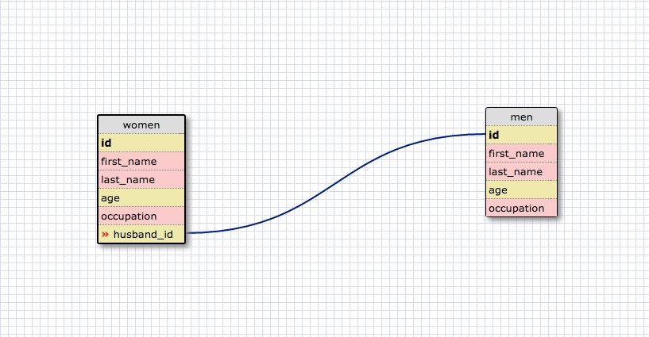
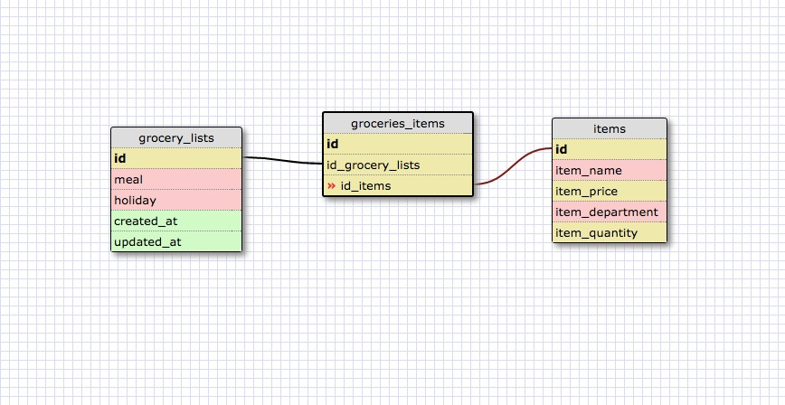

#One-to-one Relationship

This is a one-to-one relationship because a woman will only have one husband (hopefully), which is linked to the men table through husband_id.  A woman could just as easily not have an husband, in which case this field would be null.

#What is a one-to-one database?

A one-to-one database is when a row in one table will correspond to exactly one row in another table.

#When would you use a one-to-one database? (Think generally, not in terms of the example you created).

You could use a one-to-one database to link information that you might not access all that frequently, and it would make more sense to put it in another table vs. making columns for that one-to-one information in the primary table.  An example I found to help me understand this was a customers table and a customer_details table.  The customers table included first and last name, and each customer in this table had a relationship with one row in the customer_details table, which  included information like weight and height.  The customer_details could have easily been columns in the customers table, but the one-to-one relationship separating them into two tables made it easier to pull up all the customer details at once when needed by using the customer_id.

#What is a many-to-many database?

A many-to-many database is when many rows in one table can be linked to many rows in another and vice-versa.

#When would you use a many-to-many database? (Think generally, not in terms of the example you created).

You would use a many-to-many database when you needed to link more complex relationships together.  These can be linked through join tables so you can map the relationships between multiple tables.

#What is confusing about database schemas? What makes sense?

I think I'm still trying to figure out the best ways to set up foreign keys.  It makes sense in theory but if I had to set up a complex many-to-many database relationship I'm sure I'd get confused.  It will come with practice.