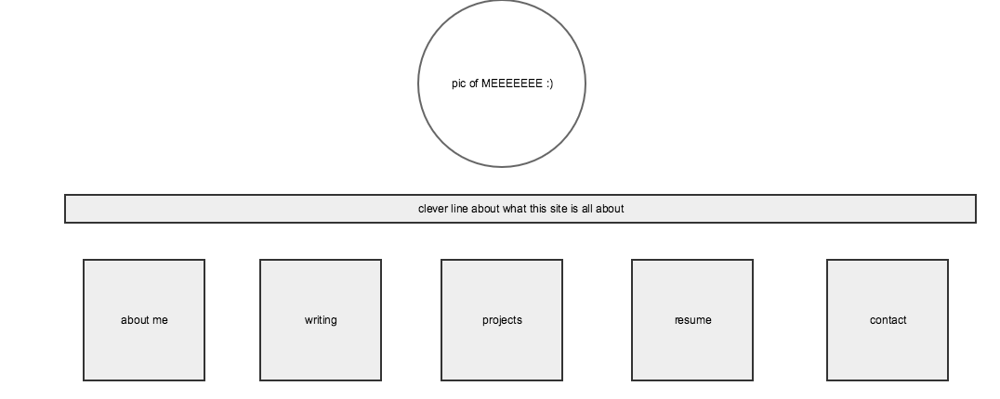
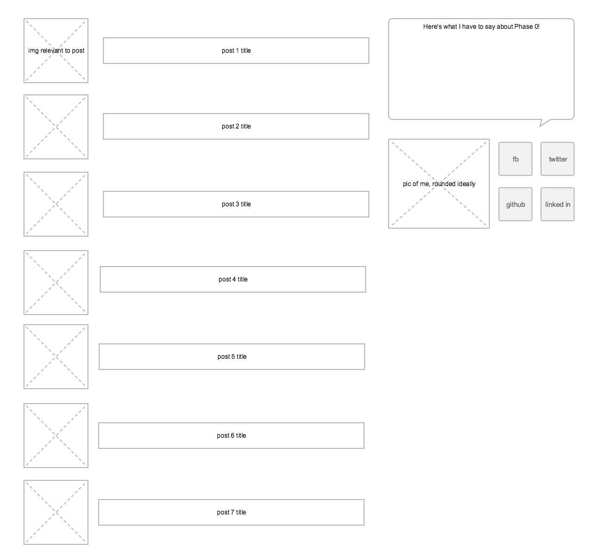

#What is a wireframe?

A wireframe is a mockup of a site that shows where elements will be placed.  It gives a sense of how the sites flows, where the user's attention will be directed, and how to set up a page for functionality.

#What are the benefits of wireframing?

It always helps to have a roadmap!  If you have a wireframe when you begin to write code for a site, you'll have a reference point for the first iteration.  Even if you end up changing something later, it helps to have a starting point so that you don't waste effort and time.

#Did you enjoy wireframing your site?

I did, kind of.  I felt a little pressured for time to get this challenge done today so I rushed through it.  I think in the future I will really enjoy wireframing because I like design.

#Did you revise your wireframe or stick with your first idea?

I revised it a bit as I saw the tools I had to play with, but it's mostly still my first idea.  Very simple.

#What questions did you ask during this challenge? What resources did you find to help you answer them?

I wondered how to use a wireframe site, so I clicked around and used cohort-mate suggestions on Slack until I found gliffy.  That covered all my needs for this challenge.

#Which parts of the challenge did you enjoy and which parts did you find tedious?

I enjoy thinking about how the site will look and how the user's eyes will flow across the page.  I am excited to get to CSS so we can add color and other design elements!  I didn't find this tedious, I just wished I had more time to devote to it.
